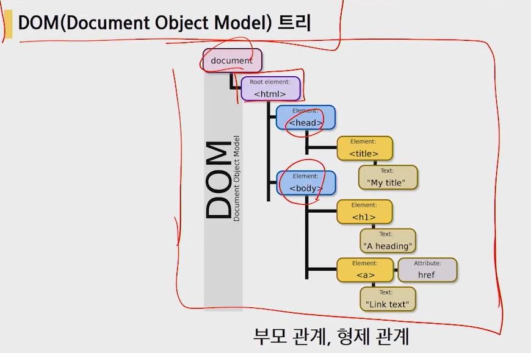

# HTML

### HTML 기본구조 


* code에서 !하면 기본 html 코드 자동완성됨.

* 사이트에서 코드보는 법.

  * ctrl shift i
  * 오른쪽버튼->검사
  * F12

* DOM
  

* 요소(element)

  HTML의 요소는 태그와 내용으로 구성됨

  ```python
  <h1>contents</h1>
  시작태그 내용 닫는태그
  ```

* ##### 속성

  속성값은 쌍따옴표로 묶는다

  속성명과 속성값사이는 붙여쓴다

  ```html
  <a href="google.com"/></a>
     속성명  속성값
  태그별로 사용가능한 속성은 다름
  ```

* HTML 글로벌 속성(모든 HTML요소가 사용가능한 공통요소)

  ```python
  id, class
  hidden lang style tabindex title
  ```

* 그룹컨텐츠

  ```
  <p>
  <hr>
  <ol>, <ul>
  <pre>, <blockquote>
  <div>
  ```

* 텍스트관련요소

  ```txt
  <a>:하이퍼링크만드는 태그
  <b> vs <strong>: 글자를 굵게 만듬.b는 
  <i>, <em>:이태리체
  <span>, <br>, 
  ```

* table 요소

  ```
  <tr>, <td>, <th>
  <thead>, <tbody>, <tfoot>
  <caption>
  colspan(열), rowspan(행) 셀병합 속성
  scope속성
  <col>, <colgroup>
  ul은 li를 만들기위한 큰태그
  ```

* form

  ```python
  서버에서 처리될 데이터를 제공하는 역할
  action
  method
  ```

  * 

  ```python
  <form>
      <label for="ㅇㅇ"></label>
      <input type="" id="ㅇㅇ" autofocus>
      label의 for와 input의 id를 같게 하면 라벨을 눌렀을 때 input칸이 반응한다
  
      <div>
          <label for="ㅇㅇ"></label>
          <select name="" id="ㅇㅇ">
              <option value="">선택</option>
              <option value="">광주</option>
              <option value="">구미</option>
          </select>
      </div>
  
      <div>
          <p>체온을 선택하시오</p>
          <input type="radio" name="" id="ㅇㅇ" value="normal">
          <label for="">37도미만</label>
          <input type="radio" name="" id="ㅇㅇ" value="warning">
          <label for="">37도미만</label>
      </div>
  </form>
  ```


* ### 시맨틱 태그

  * 장점

    1. 읽기쉽다(개발자)

    * 개발자가 의도한 요소의 의미가 명확하게 드러낸다.
    * 코드의 가독성이 높고, 유지보수가 쉽다.
      2. 접근성이 좋아진다.
    * 검색엔진 -> 시력장애용 스크린리더 -> 더 나은 사용자 경험을 제공
    * 

​		

* <i> vs <em>

* <a>

* <b> vs <strong>

* ###### form 태그

  * 서버에서 처리될 데이터를 제공하는 역할

  * action: 어디로 보낼지

  * method: get으로 사용한다.

  * ###### input태그

    * 사용자의 입력을 받는 태그
    * label태그

    

# CSS


#### CSS 적용우선순위

> 왠만하면 class선택자 사용하기

* 중요도: `!important`★★★★★(흐름을 끊으므로 웬만하면 사용금지)
* 인라인(style)/  id선택자/  class선택자/  요소선택자
* 소스 순서 

#### CSS 정의방법

1. 인라인

   해당 태그에 직접 선언하는 방법 <h1 style=color:blue;>

2. 내부 참조- <head>태그안에 <style>태그넣고 코드적음!

   <style>
       h1{
           color: blue;
       }
   </style>

   
3. 외부 참조- 분리된 .css파일

   공통된 명령을 외부참조로 만들어놓으면 간편함!

   

##### 클래스 선택자 VS ID선택자

* 한 페이지에서 여러 번 반복->클래스

  단 한번 적용될 스타일은 -> ID

  = >class속성은 어떤 분류안에 포함된 요소의 특성을 정의하는데 사용됨.

  ​	id속성은 어떤 요소에 대해 유일한 특성을 정의함. 

  ​	`HTML문서에서 특성 id속성값은 오직 하나만 있어야함.`

  <style>	
      .green {				#클래스는 .으로 시작
          color:green;	
      }

      #purple {				#id는 #으로 시작
          color: purple;
      }
      </style>

* 클래스는 속성값을 두 개 이상 가질 수 있다. 그래서 한 태그 내에서도 여러 종류의 스타일 규칙을 적용할 수 있다.

* ID선택자의 우선순위가 클래스보다 높다.

* 클래스는 나중에 다른 곳에도 적용할 수 있는 스타일을 지정(글자색 글자굵기)

* ID는 웹문서안의 요소의 배치방법을 지정할 때 자주 사용.


#### CSS 상속

* 부모요소의 속성 중 `text관련요소 만` 자식에게 상속한다
  * font, color, text-align 등