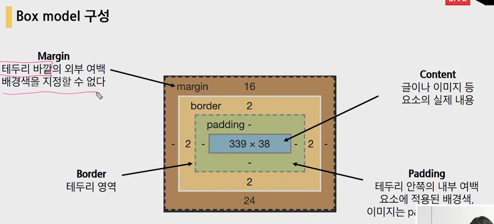
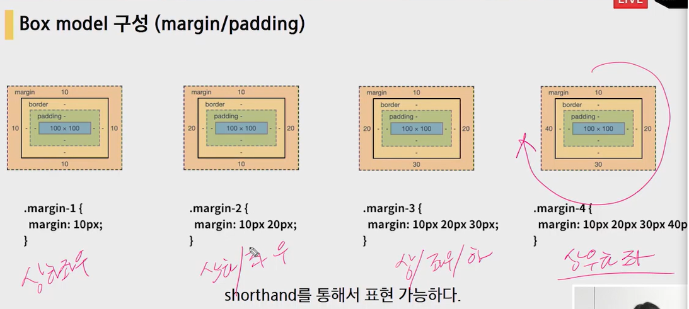

# HTML

* 웹 페이지를 작성하기 위한 언어, 웹 컨텐츠의 의미와 구조를 정의.

* html의 기본 구조

  ```html
  <!DOCTYPE html> #html문서정의
  <html>
      <head></head> #해당 html 문서의 정보를 담고있다.
      			  #제목, 문자의 인코딩, 외부로딩파일지정
      			  #브라우저에는 나타나지 않음.
      <body></body> #브라우저 화면에 실질적으로 나타나는 정보
      			  #대부분의 시맨틱태그가 사용됨.header section nav article footer
      # head와 body는 형제관계, html과 head,body는 부모관계
  </html>
  ```

* DOM tree 부모형제관계

* 요소(element) : 태그와 컨텐츠로 구성.

  * 태그별로 속성을 가짐. 각 태그마다 사용하는 속성은 다름.
  * 시맨틱 태그: 의미론전 요소를 담은 태그
    * 개발자 및 사용자 뿐만 아니라 검색엔진 등에 의미있는 정보의 그룹으로 표현이 가능.
  * 그룹 컨텐츠
    * p, hr, ol, ul, li, pre, blockquote, div
  * 텍스트 관련
    * a, b, i, strong, em, span, br, img
  * 테이블 관련
    * tr, td(셀데이터), th(테이블헤더, 제목), thead, tbody, tfoot, caption(제목이나 설명)
  * form: 서버에 처리될 데이터를 제공하는 역할
    * input: 다양한 타입을 가지는 입력 데이터 필드.
      * 공통속성: name, placeholder, required, autofocus
      * type(종류를 나타냄): text, radio, checkbox, date, password
      * label태그 : 서식 입력요소의 캡션


# CSS

* CSS : 스타일, 레이아웃등을 통해서 문서를 표시하는 방법을 지정하는 언어

* CSS 적용방법

  1. inline: 관리하기 힘들다. for test

     `<div style="background-color: red;></div>`

  2. 내부 참조방식: 하나의 html 에서만 적용. for study, test

     `<style> h1 { color: red;}</style>`

  3. 외부 참조방식: css정의를 파일단위로 묶어서 필요한 html문서마다 적용이 가능. 유지보수쉽다.

* 선택자: 특정한 요소를 선택해서 스타일링을 하기위해 반드시 필요함.

  * 기초 선택자

    * 타입(요소, 태그)선택자, 아이디 선택자, 클래스선택자, 전체선택자

  * 고급 선택자

    * 자손 선택자: 하위의 모든 요소(띄워쓰기로 구분함.)

      `article p {color: red; }` - article안의 모든p의 색을 빨강으로 바꾸시오.

      선택자1 선택자2 {속성: 속성값}

    * 직계 자손 선택자: 바로 아래의 요소(>로 구분)

      `div > p {color: blue; }`

      선택자1 > 선택자2 {속성: 속성값)

    * 형제 요소 선택자: 같은 레벨에 있는 요소 (~로 구분)

      `p ~ section {color: yello; }`

      선택자1 ~ 선택자2{속성: 속성값}

      멀리 있는 요소라도 선택가능하다.

    * 인접 형제 요소 선택자: 바로 붙어있는 형제 요소만 가능(+구분)

      `div + p {color: purple; }`

      선택자1 + 선택자2(속성: 속성값)

      ```html
          <style>
              /*자손선택자*/
              article p{
                  color: red;
              }
              /*직계 자손 선택자*/
              article > p {
                  color: blue;
              }
              /*형제 요소 선택자*/
              p ~ section{
                  color: orchid;
              }
              /*인접 형제 요소 선택자*/
              section + p {
                  color: cornflowerblue;
              }
          </style>
      </head>
      ```
    
      
  
* CSS 적용 우선순위

  1. ###### 중요도 `!important`로 나타냄. 사용 시 주의! 

  2. ###### 우선 순위

     1. 인라인: 태그에 직접 스타일을 적용한 것
     2. 아이디 선택자
     3. 클래스 선택자
     4. 속성 선택자
        * 셀렉터(속성): 해당 속성을 가진 요소를 선택
        * 셀렉터(속성=속성값): 해당 속성값을 가진 요소를 선택
     5. 수도 클래스 선택자
        * 셀렉터:hover  :해당 셀렉터 위에 마우스를 오버했을 때
     6. 요소(타입, 태그 선택자)
        * 범용(*)선택자, ('', +, ~ >)결합자는 우선순위에 영향을 미치지 않음.

  3. ###### 코드에 정의된 순서




* CSS 단위

  * px, %(기준 사이즈에서 배율), em(상속받은 사이즈에서 배수), rem(root사이즈에서 배수)

    vw(뷰포트 너비의 1%), vh(뷰포트 높이의 1%), vmin(뷰포트에서 가로세로 중 짧은 쪽 1%), vmax

  * border 테두리

  * padding 안쪽여백

  * content 글이나 이미지 등의 실제 요소

  * box-sizing

    * content-box : default값, 콘텐츠 영역의 크기
    * border-box: 박스 모델 테두리 기준으로 크기 조절

* 마진 상쇄

  * 수직 간의 형제요소에서 주로 발생
  * margin대신 padding을 이용하여 해결가능

  

* CSS Display

  * block
    
    * div, ul, ol, li, p, hr, form
    * margin으로 정렬함
    
  * inline
    * span, a, img, input, label, b, em, i, strong
    * text-align으로 정렬함
    * 컨텐츠의 너비만큼 공간을 차지 
      * width height margin-top margin-bottom은 지정할 수 `없음`
    
  * inline-block
    * 컨텐츠 너비만틈 공간차지
    * width height margin-top margin-bottom은 지정할 수 `있음`
    
  * none : 공간을 없애버림.

  * visibility: hidden은 공간은 차지하나 화면에 표시안함,

    

* CSS Position

  * static: 기본적인 배치순서에 따름(기본 값, 좌측상단)
  *  relative: 자기 자신의 초반위치를 기준으로 이동
  * absolute: 스태틱속성이 아닌 가장 가까운 부모/조상요소를 기준으로 이동
    * 기본적인 배치순서에서 제외됨.
  * fixed: 부모요소와 관계없이 브라우저를 기준으로 위치
  * sticky: relative처럼 기본배치순서는 가지고 있음.
    * 화면 밖으로 벗어나면 fixed처럼 위치에 고정되어 있음
    * 부모의 영역의 화면 밖으로 벗어나면 다시 일반적인 흐름을 따름.


