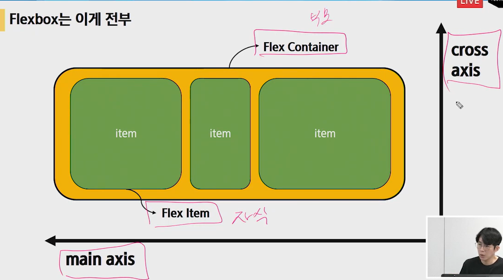

# 

#### Float 

* inline이나 텍스트요소가 이미지나 블록을 감싸도록 배치하는 기능.
* 속성:none, right, left 


#### Flex box

* 레이아웃: 요소 간 공간배분과 정렬을 위한 1차원 레이아웃

  

  * __요소__
    * flex container(부모요소)
    * flex item(자식요소)
  * __축__
    *  main axis(메인축)
    * cross axis 유를 어떤 방향으로 쌓을 건지, 자식요소. 우유한곽. 

  ```
  justify-content:메인축 기준 여러 줄 정렬
  align-items: 교차축 기준 한 줄 정렬
  align-self: 교차축 기준 선택한 요소 하나 정렬
  align-content(부모요소에 wrap으로 설정이 되어있어야 적용됨.)
  ```

  * wrap은 넘치면 밑줄로, wrap-reverse는 넘치면 윗줄로
  * nowrap은 모든 줄을 한 줄로 표시.

  ```
  justify-content:space-around;
  justify-content:space-between;
  justify-content:center;
  justify-content:flex-end;
  align-items:flex-start;
  align-items:flex-end;
  align-items:center;
  align-items:baseline;
  메인축방향정하기
  flex-direction:row;
  flex-direction:row-reverse;
  flex-direction:column;
  flex-direction:column-reverse;
  
  flex-wrap:wrap, nowrap, wrap-reverse
  flex-flow:wrap과 direction을 합침
  ```

  


#### Grid system

row가 flex-container(부모)의 역할. display:flex가 선언되는 구문.


플렉스 1차원으로 강력하게 정렬하기위해

하나의 웹을 구축하여 다양한 디바이스에 최적화된 사이트를 제공하는것(반응형웹)

그리트시스템은 그 구축을 위해 사용된 부트스트랩의 기능.(브레이크포인트중요)


js는 <body>끝나기 전에 넣고, 

#### CSS layout

