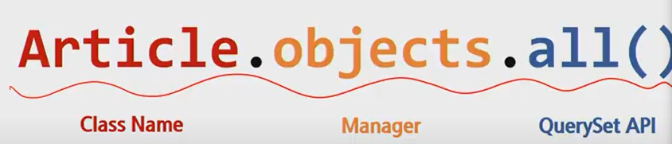

# 0819 Django Model

DB를 객체로 조작하기 위해 ORM을 사용한다

보통 클래스 이름은 앱의 단수형을 입력한다.

Model로 DB를 다루고 관리한다. 그 사이의 소통은 ORM을 이용한다.

조작을 할 때의 명령어가 DB API


## Model

* DB에 데이터를 저장하고 가져오는 것
* SQL (select * from)
* 데이터에 대한 단 하나의 정보 소스
* 저장된 데이터베이스의 구조를 의미

* django는 model을 통해 데이터를 접속하고 관리한다

* 일반적으로 각각의 모델은 하나의 데이터 베이스 테이블에 매핑


## DB

체계화된 데이터의 모임

- database의 기본 구조
  - 스키마 Schema
    - 데이터 베이스의 구조와 제약 조건에 관련한 전반적인 명세를 기술한 것.
    - 데이터베이스에서 자료의 구조, 표현방법, 관계등을 정의한 구조 
  - 테이블 table 
    - 열(필드)과 행(레코드)의 모델을 사용해 조작된 데이터 요소들의 집합 
    - SQL 데이터베이스에서는 테이블을 관계라고도 한다.
  - 기본키 PK
    - 반드시 설정하여야하며, 데이터베이스 관리 및 관계 설정시 주요하게 활용된다.


#### 쿼리 query

- 데이터를 조회하기 위한 명령어
- 조건에 맞는 데이터를 추출하거나 조작하는 명령어


#### ORM

- 객체지향 프로그래밍 
- 장점 : SQL 을 잘 알지 못해도 DB 조작이 가능, SQL의 절차적 접근이 아닌 객체지향적 접근으로 인한 높은 생산성
- 단점 : ORM만으로 완전한 서비스를 구현하기 어려운 경우가 있다. 
- 현대 웹 프레임워크의 요점은 웹 개발의 속도를 높이는 것이다. **생산성!!!!**

- 우리는 DB를 객체(Object)로 조작하기 위해 ORM을 사용한다.


## DB 생성

* 클래스를 다 정의 하고 난 후 __반드시 해야 할 일__


## Migrations

* django가 model에 생긴 변화(필드를 추가했다던가 모델을 삭제했다던가 등 )을 반영하는 방법

* 마이그레이션 실행 및 DB스키마를 다루기 위한 몇가지 명령어

  * makemigrations

    * `python manage.py makemigrations`(app이름)
    * DB에 적용하기 위한 설계도를 제작
    * app이름을 뒤에 적으면 해당 앱에 있는 models.py의 내용만 설계도를 만듦.
    * 모델을 변경한것에 기반한 새로운 마이그레이션(설계도)을 만들 때 사용
    * 모델을 활성화하기 전에 DB설계도 작성
    * 생성된 마이그레이션 파일은 데이터베이스 스키마를 위한 버전관리 시스템이라고 생각

  * `migrate`

    * `python manage.py migrate [app 이름]`
    * 만들어진 설계도를 가지고 DB테이블을 생성
    * app이름을 적으면 해당 app에 있는 migration파일을 DB에 
    * 작성된 마이그레이션 파일들을 기반으로 실제 DB에 반영하기 위해 사용 (이 명령을 해야 테이블을 생성함.)
    * db.sqlite3라는 데이터베이스파일에 테이블을 생성
    * 모델에서의 변경사항들과 db의 스키마가 동기화를 이룸

  * sqlmigrate

    - 해당 마이그레이션 파일이  SQL 문으로 어떻게 해석되어서 동작할지 미리 확인하기 위해 사용
    - ex) python manage.py sqlmigrate articles 0001

  * showmigrations

    - 마이그레이션 파일들의 migrate 여부를 확인하기 위한 명령어

      

### DB API

----

* 장고가 기본적으로 ORM을 제공함에 따라 DB를 편하게 조작할 수 있도록 도움

* Model을 만들면 장고는 객체들을 만들고 읽고 수정하고 지울 수 있는 database-abstract API를 자동으로 만듦.

* ```
  Articles(Class Name).objects(Manager).all(QuerySet API)()
  ```

  - 
  - Manager
    - django 모델에 데이터베이스 query작업이 제공되는 인터페이스
    - 기본적으로 모든 django 모델 클래스에 objects라는 manager를 추가
  - QuerySet
    - 데이터베이스로부터 전달받은 객체 목록
    - queryset 안의 객체는 0개,1개 혹은 여러 개 일 수 있음
    - 데이터베이스로부터 조회,필터,정렬 등을 수행 할 수 있음.


### Model 안의 Class 속성

-------------------

`models.py`에 모델 클래스를 정의를 해서 사용 할 수 있음.

- class 테이블명(models.Model):

  title=models.CharField(max_length=100)

  

##### CharField(max_length=None)

* 길이의 제한이 있는 문자열을 넣을 때 사용

* max_length가 필수인자

* 필드의 최대길이, 데이터베이스와 장고의 유효성 검사에서 사용

  

##### TextField()

* 글자의 수가 많을 때 사용


##### DateTimeField()

* 최초 생성 일자: `auto_now_add=True`
  * auto-now는 생성될때마다 일자 변경
  * django ORM이 최초 데이터 입력시에만 현재 날짜와 시간으로 갱신
  * 테이블에 어떤 데이터를 최초로 넣을 때 
* 최초 수정 일자: `auto_now=True`
  * django ORM이 save할 때 마다 현재 날짜와 시간으로 갱신


### Model의 중요 3단계

1. models.py :변경사항(최초의 작성, 수정, 삭제,,)발생

2. python manage.py makemigrations: 

   마이그레이션(설계도)만들기. 파일생성

3. python manage.py migrate: 

   DB에 적용. table이 만들어지는 단계

---


## 오후타임 


### CRUD

```
기본적인 데이터 처리기능인
create생성
read읽기
update 갱신
delete 삭제
를 묶어서 일컫는 말
```

db api로 할 것(데이터를 crud하는 것)


* ipython과 django-extension 설치법

  * $ pip install ipython django-extensions

  * settings.py에 등록

    ```
    INSTALLED_APPS = [
    		'articles',
    		'django_extensions',
    ```

  * pip list로 설치확인

  * $ python manage.py shell_plus 

  * ipython으로 들어가짐.

  * Article.objects.all() : 조회

    

#### create

> 데이터를 작성하는 3가지 방법

1.

* `article = Article()` : 모델 클래스로부터 인스턴스 생성

* `article.title = 'first'` : article인스턴스로 크래스 변수에 접근하여 해당 인스턴스 변수를 변경

* `article.save()`: db에 실제로 저장됨.

* article은 저장되었는지 확인할 수 있음

  ```
  In [4]: article
  Out[4]: <Article: Article object (2)>
  ```

* 이 후 sqlite로 표확인

2.

* 클래스로 인스턴스 생성시 keyword인자를 함께 작성
* `article = Article(title='second', content='django!') `
* `article.save()`: db에 실제로 저장됨.

3.

* create()메서드를 사용하면 쿼리셋객체를 생성하고 save하는 로직이 한번의 단계로 가능
* `Article.objects.create(title='third', content='django!')`


#### Read

`all()`

* `QuerySet` return
* 리스트는 아니지만 리스트와 거의 비슷하게 동작(조작가능)


`get()`

* 객체가 없으면 `DoesNotExist`에러 발생
* 객체가 여러개일 경우 `MultipleObjectReturned`에러발생
* 위와 같은 특징을 가지고 있기 떄문에 unique 혹은 Not Null특징을 가지고 있으면사용할 수 있다.(예를 들면 pk)


`filter()`

* 지정된 조회 매개변수와 일치하는 객체를 포함하는 QuerySet을 return

---


### Update

> 몇번글을 수정할 지 선택


